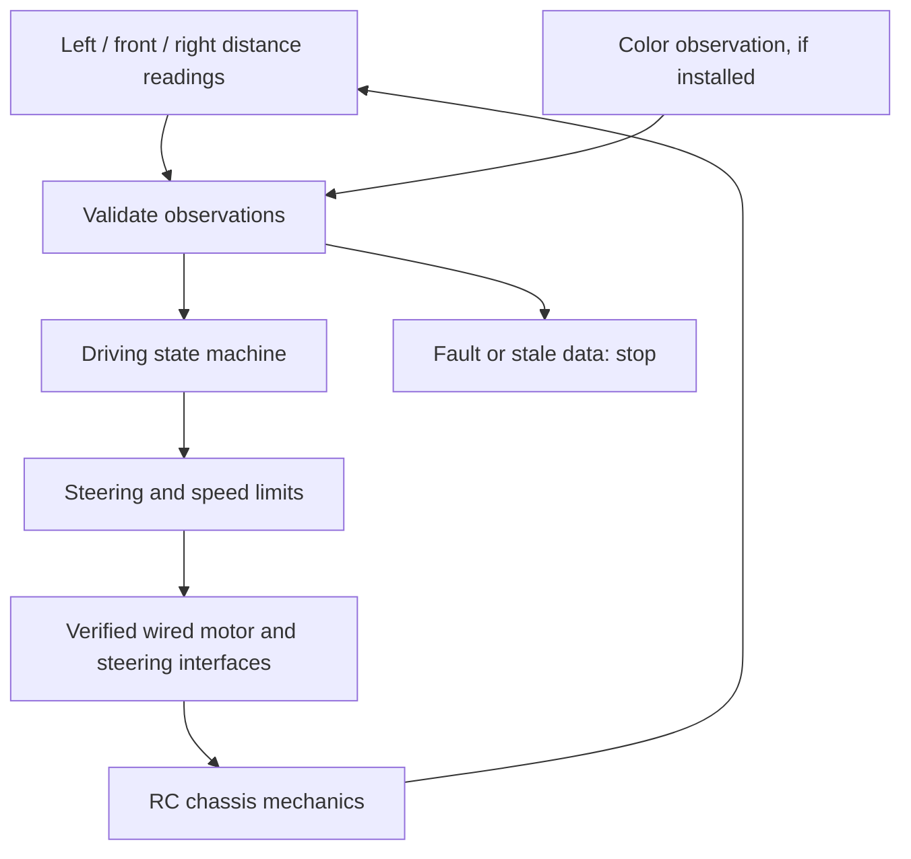

# From Remote Control to Autonomous Decisions

### WRO Future Engineers 2026 · Kuwait · engineering repository in progress

> **Project idea:** keep the useful mechanics of an RC car and replace human steering decisions with a documented sensing, control, and testing system. The decisive change is in the control loop: a person once watched the road and moved a transmitter; our vehicle must sense the course, decide locally, and command the same kinds of steering and drive actuators itself.

**Current evidence level:** the shared project conversations establish an Arduino Uno based plan and three HC-SR04 sensor connections. They do **not** establish the exact purchased chassis, the final actuator electronics, an installed camera, autonomous challenge runs, or measured performance. Sections marked **Planned / verify** are engineering work to complete, not claims of a finished robot. This repository intentionally separates a real sensor diagnostic from proposed competition control software.

## Start here

| For | Go to |
| --- | --- |
| The engineering story and revision history | [The conversion story](docs/01-story.md) |
| Chassis, steering, speed, and fit | [Mobility](docs/02-mobility.md) |
| Actual sensor pin map and power checks | [Power and sensing](docs/03-power-and-sensing.md) |
| Proposed autonomous software and obstacle strategy | [Software design](docs/04-software-and-strategy.md) |
| Repeatable experiments and honest results | [Test protocol](docs/05-testing.md) and [results log](data/README.md) |
| Assembly and Arduino upload | [Build and reproduce](docs/06-build.md) |
| Project timeline and decision records | [Engineering journal](docs/07-engineering-journal.md) |
| Evidence for every 2026 rubric criterion | [Rubric map](docs/08-rubric-map.md) |
| Competition video and photos | [Media checklist](media/README.md) |
| Source code currently present | [Firmware](src/README.md) |

## The problem we chose to solve

An RC car already solves part of a vehicle engineering problem: four wheels, a drive train, and physical steering. In ordinary RC use, however, the operator supplies the missing intelligence. The operator sees walls and obstacles, chooses a direction, and continuously corrects the steering wheel or trigger. WRO Future Engineers requires the car to complete the course autonomously. Using an RC chassis therefore does not make an autonomous vehicle by itself. It gives us a mechanical starting point and puts the engineering challenge at the boundary between **sensing** and **action**.

Our conversion has three stages. First, establish that the chassis is suitable for the 2026 vehicle limits and that its drive motor and steering actuator can be controlled electronically without the radio transmitter. Second, measure the surroundings using sensors mounted on the vehicle and verify their actual ranges, blind spots, refresh rates, and failure behavior. Third, write local software that converts sensor observations into a safe steering and speed command, then validate it against repeatable track arrangements. We should retain photos, wiring drawings, code revisions, and measured trials from each stage so another team can reproduce the decisions.

### Control path, before and after

| Part of the loop | Original RC car | Intended autonomous conversion |
| --- | --- | --- |
| Perception | Human sees the course | Vehicle sensors report distances and, if fitted, obstacle color |
| Decision | Human chooses path | Onboard state machine selects a path and speed |
| Command | Radio transmitter sends input | Controller sends wired signals to steering and motor interface |
| Feedback | Human sees the result | Controller samples again, detects failures, and corrects |
| Safety | Human releases trigger | Software stops on missing readings; physical stop/power isolation is verified |

**Rule distinction:** the RC platform is a donor of mechanical parts; radio or remote control is not used during a competition run. The final vehicle must have four wheels, a driving axle, and a steering actuator. Its dimensions must be at most 300 × 200 × 300 mm and its mass at most 1.5 kg under the 2026 international rules. [Check the actual car](docs/02-mobility.md) before describing it as compliant. National or event specific rules may differ.

## What is established today

The shared conversations show a shopping and construction **plan** for an Arduino Uno, three HC-SR04 ultrasonic sensors (left, front, right), a motor driver, a regulated 5 V supply, and possibly a Pixy2 camera. They recommend looking at a WLtoys K989 RC chassis, but a recommendation is not proof of purchase or final installation. A later conversation gives explicit wiring instructions for three ultrasonic sensors. Those six signal connections are recorded below as the **reported pin assignment**, pending a physical continuity check on the assembled car:

| Sensor | Trigger | Echo | Power | Ground | Evidence |
| --- | --- | --- | --- | --- | --- |
| Left HC-SR04 | D2 | D3 | 5 V rail | Ground rail | Shared wiring conversation |
| Front HC-SR04 | D6 | D7 | 5 V rail | Ground rail | Shared wiring conversation |
| Right HC-SR04 | A0 | A1 | 5 V rail | Ground rail | Shared wiring conversation |

The conversation described an Arduino USB cable powering **only the sensor prototype**. It did not establish a battery wiring schematic that is safe for the motor, servo, camera, and controller together. Do not infer a final power design from the breadboard prototype. Also do not connect the vehicle motor or steering to pins invented in a README. A complete pinout, measured supply rails, verified common ground, fuse/switch strategy, and current budget are required before the drive system is enabled.

| Subsystem | Status | Next proof to add |
| --- | --- | --- |
| Three distance sensor pin assignments | Documented in conversation; physical wiring unverified | Clear wiring photo and serial distance log |
| RC chassis and steering geometry | Candidate discussed; exact final model unconfirmed | Model label, six views, dimensions, wheelbase, steering mechanism |
| Motor driver and servo interface | Candidate parts discussed; integration unconfirmed | Part numbers, datasheets, measured voltage/current, actual pin map |
| Camera / color discrimination | Pixy2 proposed; installation unconfirmed | Mounted photo, signature configuration, red/green confusion matrix |
| Autonomous navigation and parking | Proposed architecture | Final firmware plus timed, filmed, repeatable trials |

## Architecture under development

The ultrasonic readings are suitable for wall clearance and near object distance. They **cannot by themselves distinguish red from green**. The obstacle challenge requires a tested means of observing sign color and position, so the camera is a design candidate, not a completed capability. A controller with one front distance sensor and two side distance sensors cannot reliably infer every corner, lap, or parking pose without additional logic and validation. The [software design](docs/04-software-and-strategy.md) labels these unknowns and proposes controlled experiments.

### Source code status

`src/sensor-diagnostic/sensor-diagnostic.ino` is an **actual Arduino sketch** for checking the three reported HC-SR04 signal pairs one at a time. It emits timestamped CSV with distance in centimetres or `INVALID` after a bounded echo timeout. It does not drive motors and is not represented as competition software. This deliberate first step makes the sensor side of the control loop measurable before actuators are energized. Upload details and validation steps are in [Build and reproduce](docs/06-build.md).

The intended final program will contain separate sensor acquisition, observation validation, driving state, steering/speed control, and actuator output modules. The final implementation must be committed here as source code with comments and reproducible build steps; architecture notes alone cannot satisfy the competition's code requirement. Decisions about timing, direction detection, sign handling, parking, and emergency stopping must be backed by recorded trials.

## Engineering evidence and experiments

The project journal is organized around claims that can be tested. For each change, record the prior behavior, a hypothesis, one controlled modification, the same evaluation course, and the measured outcome. At minimum, record the car's width/length/height and mass; straight line speed at defined battery state; minimum turning radius in each direction; stopping distance; sensor error at known wall distances; and obstacle and open challenge completion rates over multiple configurations. Record failures as carefully as successes.

Use [the trial CSV template](data/trials-template.csv) for each run. Never present an empty template as results. Videos should show an uninterrupted segment of autonomous driving, identify challenge and run ID, and link back to the corresponding trial log. The 2026 rules call for one video **per challenge** with at least 30 seconds of autonomous driving footage, along with vehicle photos from every side/top/bottom and a team photo. The [media folder](media/README.md) records what is still missing.

## Reproduction path for another team

1. Read [mobility](docs/02-mobility.md), measure your actual chassis, and make sure the steering and drive architecture meets the applicable rules.
2. Inspect [power and sensing](docs/03-power-and-sensing.md), then confirm actual polarity and signal pins with the battery disconnected. A breadboard rail color is only a label; check continuity.
3. Power the Arduino from USB for the **sensor-only** diagnostic. Upload the sketch with Arduino IDE, open Serial Monitor at 115200 baud, and collect the CSV output with three known reference distances.
4. Add verified photos and measurements to the journal, record exact part numbers and a measured power budget, and revise the wiring diagram to match the built car.
5. Implement and bench-test actuator commands only after the motor and servo interface is identified and powered correctly. Start with wheels raised and physical power cutoff within reach.
6. Add autonomous software incrementally: wall clearance, direction and corner handling, colored signs, lap tracking, then parking. Measure each stage using identical courses and battery conditions.
7. Publish the complete firmware, CAD/mounting files if used, six vehicle views, team photo, both driving videos, engineering journal, and real trial data. Re-run [the repository check](scripts/check_repository.py) before submission.

## Competition and publication notes

The [official 2026 rules](https://wro-association.org/wp-content/uploads/WRO-2026-Future-Engineers-Self-Driving-Cars-General-Rules.pdf) require a public English GitHub repository, code for every programmed component, a README of at least 5,000 characters, photos, two driving videos, and at least three commits with timing constraints relative to the event. A repo assembled today **cannot retroactively satisfy past commit deadlines**. Confirm the applicable Ontario Open Championship dates and any organizer adjustments; preserve real Git timestamps. The rules describe submitting the repository link three weeks before the event, with further snapshots one month and two weeks before it. A hardcopy is also required at the international final; check event instructions for this specific championship. The [2026 documentation rubric](https://wro-association.org/wp-content/uploads/WRO-2026-Future-Engineers-Documentation-Rubric.pdf) scores five criteria at up to six points each. The [rubric map](docs/08-rubric-map.md) is an honest completion list, not a claim of 30 points.

## References and provenance

- Team planning conversations about the initial RC/parts plan, sensor wiring, and Arduino laptop setup supplied the prototype pin assignments. They are planning notes, not proof of a built vehicle. Public links to the conversations are omitted to keep unrelated discussion out of the competition submission.
- [WRO 2026 rules](https://wro-association.org/wp-content/uploads/WRO-2026-Future-Engineers-Self-Driving-Cars-General-Rules.pdf) and [documentation rubric](https://wro-association.org/wp-content/uploads/WRO-2026-Future-Engineers-Documentation-Rubric.pdf) determine this repo's structure.
- The [official 2025 final scoreboard](https://scoring.wro-association.org/en/event/scoring/293) shows Double-X at 29.3 documentation points and KMIDS GFM and STORMS NGR at 29.0 each. [KMIDS GFM's repository](https://github.com/Chayanon-Ninyawee/KMIDS-GFM-Future-Engineer-2025) provides a useful example of clearly linked photos, video, mobility, power, software, parts, and build instructions. The [WRO archive of 2025 team repositories](https://github.com/World-Robot-Olympiad-Association/fe-2025-links) helps compare other solutions. Our writing and architecture are original and should describe only our own car.

**Team:** Kuwait Future Engineers team — add the confirmed team name, student members, roles, and mentor attribution before publication. **Repository maturity:** documented prototype, with final vehicle and performance evidence pending.
