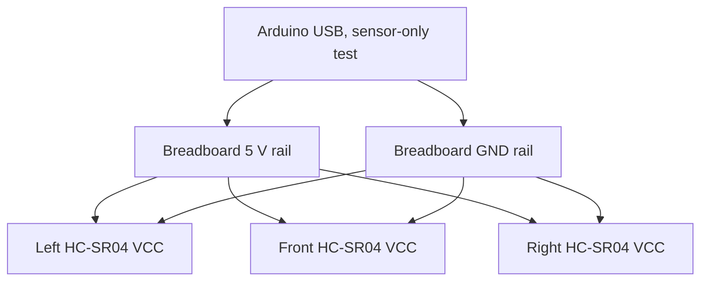

# Power and sensing

## Confirmed conversational pin plan

The project chat explicitly maps three HC-SR04 units to Arduino Uno pins. This is a **reported plan**, requiring continuity and photo confirmation on the physical car.

| Sensor | HC-SR04 VCC | GND | TRIG | ECHO |
| --- | --- | --- | --- | --- |
| Left | Breadboard + / Arduino 5 V, red in chat | Breadboard − / Arduino GND, black | D2, yellow | D3, green |
| Front | + / 5 V, orange | − / GND, white | D6, blue | D7, purple |
| Right | + / 5 V, brown | − / GND, purple | A0, yellow | A1, orange |

Wire color is a *description of that exchange*, not a reliable electrical standard. Read the printed **VCC, TRIG, ECHO, GND** labels on each board and confirm continuity with a multimeter. Breadboard power rails can be split internally: verify continuity along each segment and bridge only the intended same-polarity segments. Disconnect power before rearranging wires.

Signals go directly to the listed Arduino pins. The diagram describes **only the prototype's sensing power**. It must not be interpreted as a motor/servo battery schematic. Before adding a motor driver or servo: identify exact battery chemistry and voltage, measured stall/peak currents, driver voltage rating, regulator continuous current, fuse and cutoff rating, wiring gauge, and whether signal grounds must be common. Never drive a motor from Arduino I/O or the USB 5 V pin.

## Final power budget worksheet

| Load | Supply rail | Idle current | Peak measured current | Measurement method |
| --- | --- | --- | --- | --- |
| Arduino Uno | TBD | TBD mA | TBD mA | In-line meter on final supply |
| Three HC-SR04 | 5 V candidate | TBD mA | TBD mA | Data sheet + measured total |
| Color camera, if installed | TBD | TBD mA | TBD mA | Measure during recognition |
| Steering actuator | TBD | TBD mA | TBD mA | Steering against realistic load |
| Drive motor + driver | TBD | TBD A | TBD A | Wheels loaded; safe meter setup |
| Regulator loss / margin | TBD | — | TBD | Datasheet efficiency at measured current |

The chosen regulator should handle measured simultaneous peaks with margin; a camera or servo reset during acceleration is a failure even if the average current looks fine. Log battery voltage before and after each test. Record brownouts and loose connections as faults, not as navigation failures.

## Sensor tests

Measure each sensor facing a flat wall at 10, 20, 30, 50, and 80 cm if the particular unit returns stable readings there. For each distance, log at least 10 readings and report median absolute error, invalid fraction, and largest deviation. Then test against angled walls, near corners, and colored traffic sign faces. Ultrasonic transducers can hear echoes from another sensor; the diagnostic sketch triggers them **sequentially** with a pause. Test whether the three readings remain stable when all sensors are mounted on the moving car.

If a camera is installed, collect a labeled red/green dataset at near, middle, and far positions and across available lighting. Report confusion counts and the distance at which each sign is reliably identified. Color and distance should be associated with the same physical object before choosing a passing side. Calibration screenshots and software signature configuration belong in `media/` and `src/`.

## Failure rules for later control software

- Timeout, disconnected sensor, zero echo, or unreasonably large reading is **invalid**, not a clear path.
- Require a fresh timestamp for decisions and slow or stop when required observations are stale.
- If the distance and camera disagree, record the conflicting observations and choose a conservative maneuver.
- Implement a tested startup delay/ready state and a physical power cutoff.
