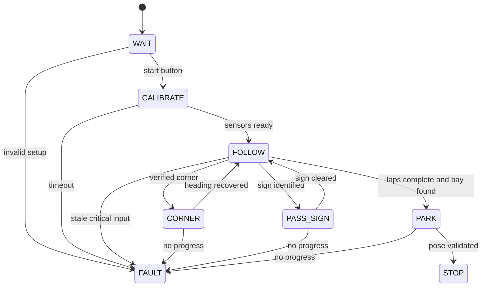

# Software architecture and challenge strategy

**Status:** design proposal. The supplied conversations do not contain final navigation firmware. The only executable source here is the sensor diagnostic.

## Modules for the final firmware

| Module | Inputs | Outputs | Failure behavior |
| --- | --- | --- | --- |
| Distance acquisition | Six Uno pins for three HC-SR04 | cm, validity, timestamp per sensor | Bounded echo timeout; no fabricated long range |
| Color observation | Verified camera/interface | red/green/unknown, confidence, relative position | Unknown when confidence low |
| Observation validation | Distance and color stream | recent consistent scene | Stop or limited crawl on missing critical input |
| Navigation state machine | Scene and direction/lap context | target corridor, speed tier, reason code | Enter FAULT after persistent contradictions |
| Motion controller | Corridor error and speed target | bounded steering and motor request | Clamp outputs and prevent abrupt reversal |
| Actuator adapter | Requests and verified pin map | wired motor/steering signals | Zero throttle on timeout and at startup |
| Run logger | States and measurements | serial/recorded logs | Record faults with run ID |

The diagnostic sketch demonstrates sequential acquisition and a bounded timeout. It intentionally has no actuation pins. Before adding them, record the real steering center, endpoints, pulse format or motor driver interface, reversal/brake semantics, and power budget.

## Candidate state machine

Every transition needs a measured trigger, cooldown/debounce rule, maximum duration, and log message. `CALIBRATE` must not use radio input during the run. A final program should handle clockwise and counterclockwise driving without relying on a single hardcoded sign order or start zone. The field setup can change between rounds.

## Open Challenge: candidate method

Start slowly, keep a measured clearance from the nearest wall, and estimate lateral error from side range readings. Filter only enough to suppress isolated acoustic echoes; too much smoothing delays a corner response. A front range threshold alone is ambiguous. Detect a corner with a conjunction of front distance trend, relevant side distance, elapsed travel, and current turn state. Bound steering so a late reading cannot command an actuator beyond its physical endpoints. Validate on both directions and shifted inner wall configurations. Without wheel odometry or reliable landmarks, lap counting remains unresolved; document the tested approach before claiming three laps.

## Obstacle Challenge: candidate method

The camera candidate would identify red and green pillars. The controller should determine *which side* the vehicle must pass for each color under current rules, associate the detection with range and position, choose a trajectory that respects wall clearance, then confirm the pillar has been passed. The ultrasonic trio alone cannot distinguish colors. If the Pixy2 is not installed and calibrated, this challenge remains unsolved. Provide examples of false positives under shadows and reflective surfaces and count them in a confusion matrix.

For parallel parking, define the parking bay detection signal, target pose, low-speed motion stages, reversal points, and stop condition. Check the 2026 rules' bay dimensions and contact scoring. A fixed-duration reverse maneuver is only a baseline; repeat it with different battery states and bay positions and record contact rate and final angle. Do not claim parking success without video and measurements.

## Suggested control law and tests

A simple proportional wall controller could use `e = measured_side_clearance - desired_clearance` and `steering = clamp(center + Kp * e, left_limit, right_limit)`. Choose sign convention from bench tests. Tune `Kp` on a fixed straight section and report average clearance error and maximum overshoot; compare against a constant steering baseline. Add derivative/integral action only when data justifies it. Lower speed at corners and obstacles, and set a conservative stop distance based on measured stopping distance plus sensor/compute latency.

For each run log: monotonic time, raw ranges, validity, detected color/confidence, state, target steering, actual command, supply voltage, and a reason code for each state change. Use actual code version/hash with trial data. Performance metrics: valid run fraction, laps completed, collisions/contacts, error in wall clearance, maneuver time, and parking success rate across at least five randomized configurations.
